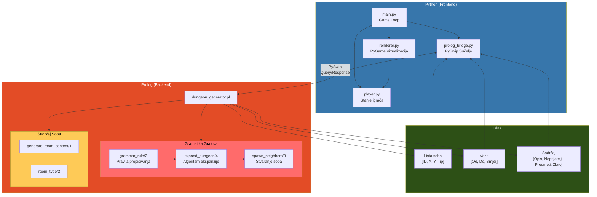

## Objašnjenje arhitekture

### Python (Frontend)
- **main.py**: Glavna petlja igre, upravlja događajima i poziva renderer
- **renderer.py**: PyGame vizualizacija dungeona, soba i igrača
- **player.py**: Stanje igrača (HP, inventar, zlato)
- **prolog_bridge.py**: Most između Pythona i Prologa korištenjem PySwip biblioteke

### Prolog (Backend)
- **dungeon_generator.pl**: Glavni modul za generiranje
  - `grammar_rule/2`: Definira pravila gramatike grafova
  - `expand_dungeon/4`: BFS algoritam za ekspanziju grafa
  - `spawn_neighbors/9`: Stvara nove sobe na gridu
  - `generate_room_content/1`: Generira sadržaj za svaku sobu

### Komunikacija
Python poziva Prolog putem PySwip biblioteke. Prolog vraća:
1. **Sobe**: `[ID, X, Y, Tip]`
2. **Veze**: `[Od, Do, Smjer]`
3. **Sadržaj**: `[Opis, Neprijatelji, Predmeti, Zlato]`
