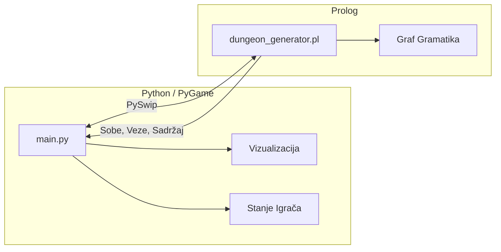

## Opis

**Python (Frontend)**
- Vizualizacija dungeona pomoću PyGame
- Upravljanje stanjem igrača (HP, inventar)
- Kontrola igre i korisničkog unosa

**Prolog (Backend)**  
- Generiranje strukture dungeona pomoću graf gramatike
- Ekspanzija soba prema pravilima prepisivanja
- Generiranje sadržaja soba (neprijatelji, predmeti)

**Komunikacija**
- Python poziva Prolog putem PySwip biblioteke
- Prolog vraća podatke o sobama, vezama i sadržaju
