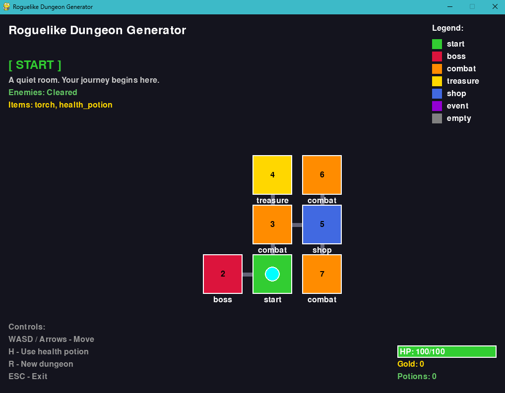

# Roguelike Dungeon Generator

**Deklarativni generator dungeona** koji koristi **Prolog** za inteligentnu generaciju topologije i sadržaja, te **Pygame** za vizualizaciju i gameplay.


---

## O Projektu

**Autor:** Luka Kukec  
**Mentor:** doc. dr. sc. Bogdan Okreša Đurić  
**Fakultet:** Fakultet organizacije i informatike, Sveučilište u Zagrebu  
**Kolegij:** Deklarativno programiranje

Ovaj projekt je razvijen kao dio projekta "Generiranje razina igre korištenjem gramatike grafova".

---

## Vizija i Cilj

Ovaj projekt istražuje moć **logičkog programiranja** u domeni proceduralnog generiranja sadržaja (PCG). Za razliku od klasičnih algoritama, koristimo **gramatike grafova** i **ograničenja (constraints)** kako bismo osigurali da svaki generirani dungeon bude:
1.  **Strukturno ispravan** (povezan graf, bez izoliranih soba).
2.  **Balansiran** (pametan raspored neprijatelja, shopova i blaga).
3.  **Igrabilan** (zajamčen put od starta do bossa).

---

## Tehnološki Stog

-   **SWI-Prolog**: Core motor za generiranje. Koristi dinamičke predikate i backtracking.
-   **PySwip**: Most koji omogućuje Pythonu da izvršava Prolog upite u stvarnom vremenu.
-   **Pygame**: Lagan i brz engine za 2D renderiranje i rukovanje unosima igrača.

---

## Struktura Projekta

```bash
Rougelike/
├── Dokumentacija/
│   ├── Rad.tex                # Izvorni kod projekta (LaTeX)
│   ├── Rad.pdf                # Kompilirani rad
│   └── slike/                 # Slike korištene u dokumentaciji
├── prolog/
│   └── dungeon_generator.pl   # Logika generacije (Graph Grammar)
├── src/
│   ├── main.py                # Ulazna točka aplikacije
│   ├── player.py              # Logika igrača i statistike
│   ├── renderer.py            # Vizualizacija dungeona i UI
│   └── prolog_bridge.py       # Komunikacijsko sučelje s Prologom
├── tests/                     # Testovi za Python i Prolog
└── README.md
```

Za detaljan opis teorijske podloge i implementacije, pogledajte [Dokumentacija/Rad.tex](Dokumentacija/Rad.tex).

---

## Kako Pokrenuti?

### 1. Preduvjeti

| Ovisnost | Verzija | Link |
|----------|---------|------|
| **SWI-Prolog** | 9.x | [Download](https://www.swi-prolog.org/download/stable) |
| **Python** | 3.10+ | [Download](https://www.python.org/downloads/) |

> **Napomena**: SWI-Prolog mora biti dodan u sistemski PATH. Instalacija to obično napravi automatski.

#### Linux instalacija SWI-Prologa

**Ubuntu/Debian:**
```bash
sudo apt install swi-prolog
```

**Arch Linux:**
```bash
sudo pacman -S swi-prolog
```

### 2. Automatska instalacija i pokretanje

**Linux (preporučeno):**
```bash
python3 setup_venv.py
```
Skripta kreira virtualno okruženje, instalira ovisnosti i pokreće igru.

**Windows:**
```bash
python setup.py
```

### 3. Ponovno pokretanje igre

**Linux:**
```bash
./venv/bin/python src/main.py
```

**Windows:**
```bash
python src/main.py
```

### 4. Ručna instalacija (opcionalno)

```bash
# Windows
pip install -r requirements.txt
python src/main.py

# Linux (koristite venv)
python3 -m venv venv
./venv/bin/pip install -r requirements.txt
./venv/bin/python src/main.py
```

### 5. Testiranje (opcionalno)
```bash
# Python testovi
python -m pytest tests/ -v

# Prolog testovi
swipl -s tests/test_dungeon_generator.pl -g run_all_tests -t halt
```

---

## Prikaz Rada



## Kontrole i Gameplay

| Tipka | Akcija | Opis |
| :--- | :--- | :--- |
| **W, A, S, D** | Kretanje | Pomakni igrača po sobama dungeona |
| **Strelica** | Kretanje | Alternativne tipke za kretanje |
| **H** | Heal | Koristi napitak za zdravlje (ako ga imaš u inventoryju) |
| **R** | Regeneriraj | Stvori potpuno novi dungeon s novim seed-om |
| **ESC** | Izlaz | Zatvori aplikaciju |

### Mehanike
- **Borba**: Automatska pri ulasku u sobu s neprijateljima. Šteta ovisi o tipu neprijatelja.
- **Loot**: Skupljaj zlato i predmete (napitke) nakon što očistiš sobu.
- **Pobjeda**: Pronađi i porazi bossa u crvenoj sobi.

---

## Logika Generacije

Sustav koristi **Graph Grammar** pristup:
- Svaki dungeon počinje od `start` čvora.
- Pravila ekspanzije (npr. `combat -> treasure`) definiraju kako se dungeon grana.
- **Constraints** osiguravaju minimalnu udaljenost od starta do bossa i smještaj blaga u slijepe ulice (dead-ends).

### Boje Soba
- 🟢 **Start**: Početna točka heroja.
- 🔴 **Boss**: Finalni izazov (Victory uvjet).
- 🟠 **Combat**: Sobe s neprijateljima.
- 🟡 **Treasure**: Bogat loot, obično u slijepim ulicama.
- 🔵 **Shop**: Sigurna zona za trgovinu.
- 🟣 **Event**: Nepredviđeni susreti.

---

## Licenca
Ovaj projekt je licenciran pod **GPL-3.0** licencom.
